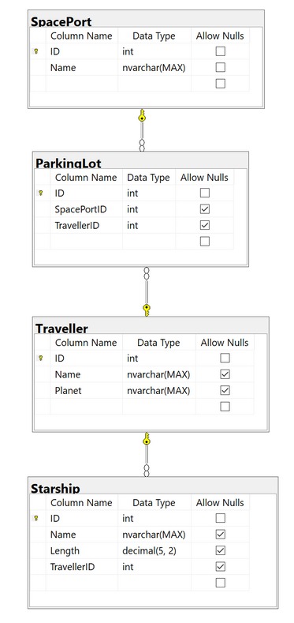
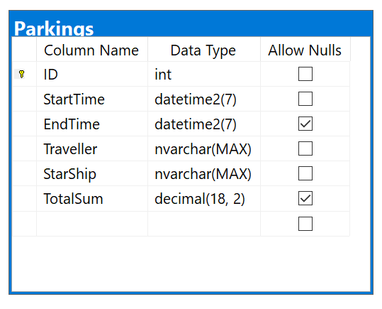

# SpacePark
Reser runt i rymden, vi behöver stanna till och parkera skeppet.. Detta sker i en `SpacePort`.
`SpacePort` kontrolleras av `SpacePark` (lite som Göteborgs parkering).
Vi ska utveckla åt `SpacePark`.

## Vi ska:
- Registrera parkeringar (Namn på resenär, skepp, vilken planet resenären kommer ifrån?)
- Öppna/stänga baserat på om det är fullt eller inte. Vi kan bara öppna åt skepp som det finns plats för
- Alla parkeringar ska registreras i en databas med Entity Framework Core (SQL?) Code first. Alla queries till databasen ska göras med Entity Frameworks fluent API.
- ENDAST kända Starwars karaktärer får parkera på denna `SpacePort`. 
  - Dessa identifieras när de anländer till en `SpacePort`, de ska betala innan de kan lämna parkeringen, och sist ska de kunna få ett **"kvitto"**. (TimeTable som räknar ut hur länge personen har stått där samt hur mycket som ska betalas?)
- Vi ska hämta data med hjälp av REST API: https://swapi.dev/, Vi måste requesta API varje gång vi vill hämta data, dessa request ska göras med async.
- En rekommendation är att använda https://restsharp.dev/ detta NuGet paket. Läs på om denna via länken.
- Resenärerna kan endast använda `Starship` som de kan använda. Se swapapi. 
- The travlers only use `Starship` which have been part of a Starwars movie (see the endpoint /`Starship`). 
- They should be able to select their starship on arrival in the application.
- Samtliga requests ska vara asynkrona

## Som jag förstår det:
1. Menyval vid start av konsol: två alternativ, det ena är "Register new parking" (Se punkt 2-7) och den andra är "End current parking" (se punkt 8).
1. Låt användaren knappa in ett namn
1. Anropa API med Async och kolla sedan om det matchar med någon "people" i starwars API’t. (Detta kan göras exempelvis genom att endast anropa "people/" så att vi får ut en count. Sedan loopar vi igenom för att se om namnet som användaren knappat in matchar med någon av de som finns i API’t.
1. Kolla så att `SpacePark` parkeringen inte är full, om den inte är full så gå till nästa steg
1. Om namnet matchar med det användaren knappat in, anropa då API för just den personens startships och ge hen ett menyval (som i Jakobs kurs) där den får välja vilken `Starship` som ska parkeras. Kanske ha en Console.Writeline("Welcome Luke Skywalker, which `Starship` are you docking?")
1. När Användaren valt ett skepp så måste vi sedan kolla så att det finns plats för skeppet, kanske kan hämta längden på skeppet i API’t? Då behöver vi isåfall sätta en gräns på hur långt ett skepp får vara. Om det finns plats så hoppa till nästa steg.
1. Om skeppet får plats samt att resenären är en Starwars karaktär (alltså om alla steg ovan gått igenom), så behöver vi registrera dessa i databasen. 
1. Lägg in ett slutpris i databasen för den parkeringen. 

## Att tänka på:
- Vad ska vi ha för tabeller i databasen? Vad ska de innehålla? Hur ska de vara kopplade till varandra?
- Ska vi kunna hämta en "saved" parkering? 
- Ska vi beräkna priset på global datetime? Kanske 10kr/min bara för att demonstrera
- Vi kommer behöva hämta: people, planet, starship, station? Som API.
- Hur ska vi räkna på vad som får plats i stationen? Räknar vi på `Length` eller passenger? Eller hur gör vi här?
- Vi behöver få hem dessa API: people: `Name`, planets(optional?) | `Starship`: `Name`, `Length`
  - `planets`-apit är väl en bra att använda så vi kan ge varje `SpacePort` ett namn?

## Table demonstration EXAMPLE:
**Vi behöver även lägga till en `Invoice` eller `Receipt` tabell.**

## Update Database

We have made some changes in our database. As a starting point, we wanted to create tables with relationships between them. But after a few discussions, we figured that such complexity is not needed. Therefore, we decided to work with one table where the EndTime determines if a parking is active or not. If the EndTime column is null, then the parking is currently active. If not, then the parking is finished. Once the parking is finished and the Traveller is leaving, we will also add the totalSum to the table where the price is calculated based upon the travellers StartTime and Endtime (totalSum = StartTime – EndTime). We calculate the MINUTE value where the total price is the difference in minutes between StartTime and EndTime x 2.   

_How the database table looks now:_

_Data from the database table. All EndTime/TotalSum columns that contains ‘NULL’ is currently active parkings. The others are finished and paid for:_

